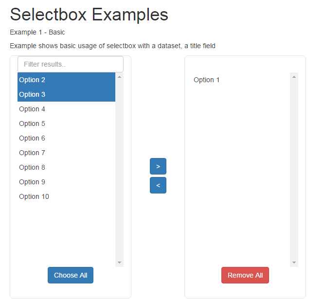

Angular Selectbox
=======================================================================================

A simple two way select box. 



[Live Example](http://infinitet3ch.com/examples/angular-selectbox)

Installing
```
npm install angular-selectbox
```

Needs
```
bootstrap
```

Usage
```
angular.module("MyModule", ['selectbox'])
	.controller("MyCtrl", function($scope) {
		$scope.data = [
			{
				"title": "Example data" 
			},	
			{
				"title": "Another Example" 
			}
		];
		$scope.selectedData = [
			$scope.data[0]
		];
	 } );
```

HTML
```
<selectbox model-data="data" model="selectedData"></selectbox>
```

